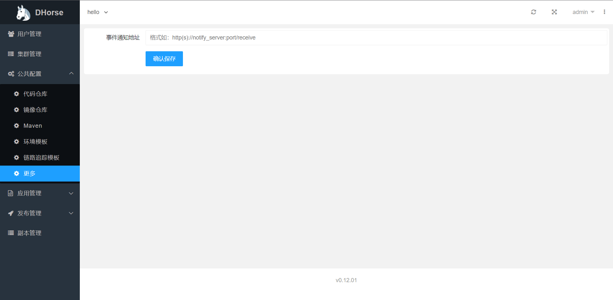

为了更好的与第三方系统集成，DHorse提供了事件通知功能，如：构建版本完成通知、部署环境完成通知等。

# 事件通知地址

开发者可以根据图1来配置事件的接收地址。该地址采用POST+JSON访问方式，入参见《事件通知模型》章节，无需出参模型，只需要接口返回200状态码即可。


图1

# 事件通知模型

目前，DHorse提供了两个事件，构建版本完成通知和部署环境完成通知，事件通知数据模型分别如下。

## 构建版本完成通知

通知模型如下：

```json
{
	"eventCode": "6001", 						//事件编码
	"data": { 									//通知内容
		"submitter": "admin", 					//构建人
		"branchName": "release/war", 			//构建分支
		"tagName": "1.0.2", 					//构建tag
		"appName": "hello", 					//应用名称
		"verionName": "hello:v20230220_175932", //构建版本
		"status": 2								//构建状态，1：构建成功，2：构建失败
	}
}
```

## 部署环境完成通知

通知模型如下：

```json
{
	"eventCode": "6002", 						//事件编码
	"data": { 									//通知内容
		"submitter": "dhorse", 					//部署人
		"approver": "admin",  					//审批人
		"branchName": "release/war", 			//部署分支
		"tagName": "1.0.2", 					//部署tag
		"appName": "hello",						//应用名称
		"verionName": "hello:v20230312_205643",	//部署版本
		"status": 2, 							//部署状态，2：部署成功，3：部署失败，4：合并成功，5：合并失败，8：回滚成功，9：回滚失败
		"envTag": "qa" 							//环境标识
	}
}
```

## 事件编码

| 编码 | 描述
| :----: | :----: |
| 6001 | 构建版本
| 6002 | 部署环境