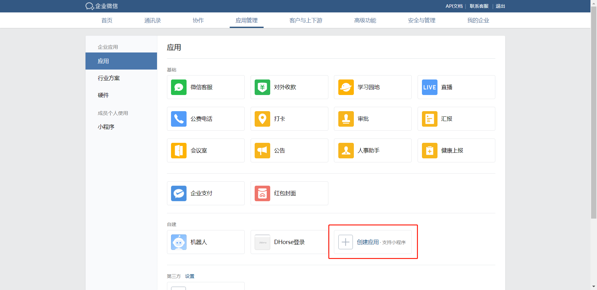
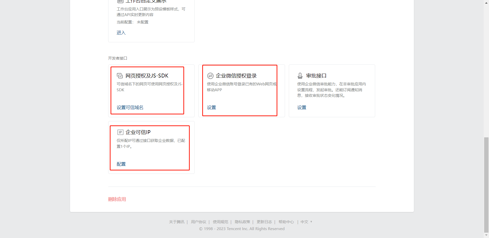
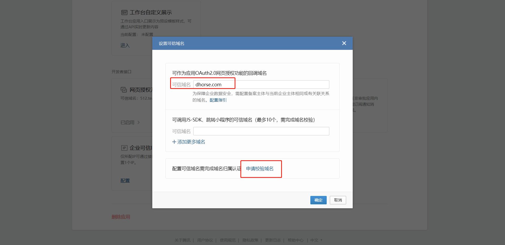
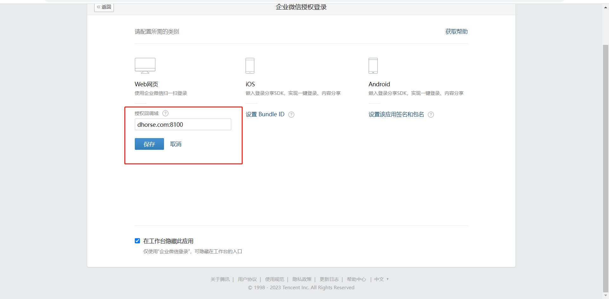
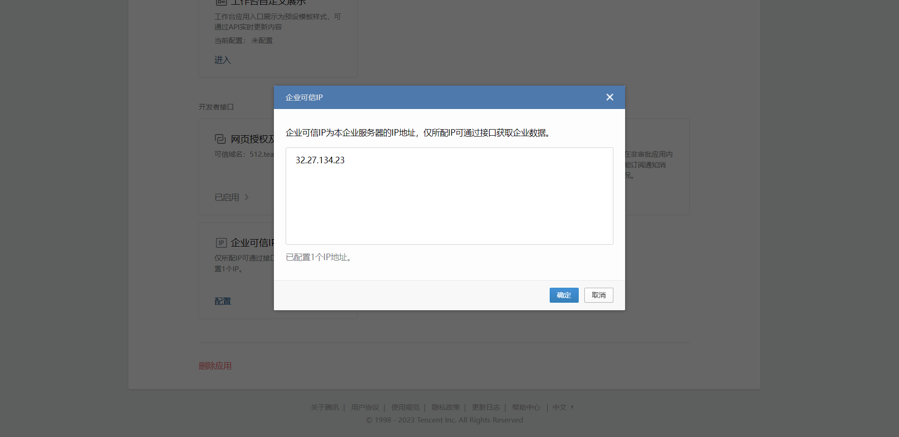
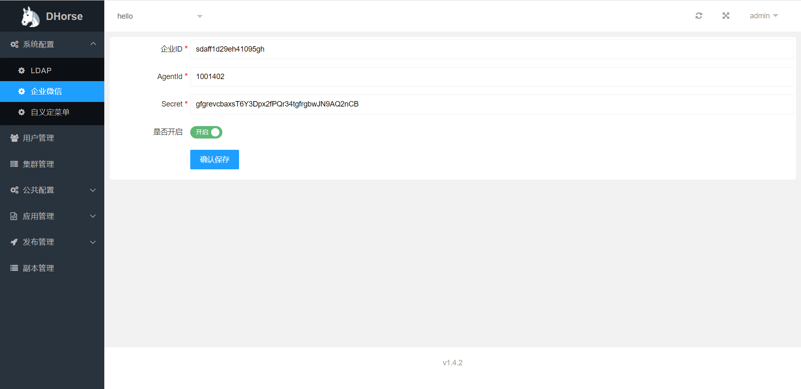
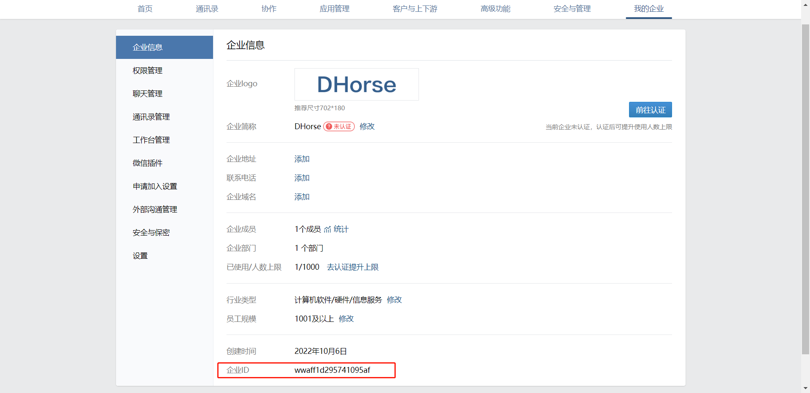
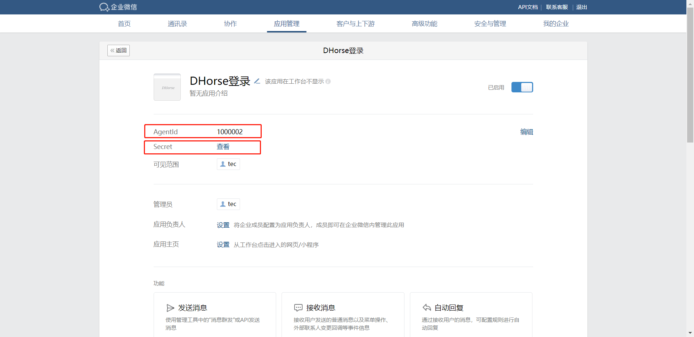

开启企业微信登录，需要满足以下几个条件：
* 需要具备企业微信后台的管理权限；
* 在企业微信后台需要创建应用；
* 需要在DHorse里配置企业微信；

### 创建应用

##### 创建应用，如图1所示：

图1

#### 配置应用

接下来，进入应用管理页面，依次配置图2所示的内容。

如图2所示：

图2

##### 网页授权及JS-SDK

配置可信域名，并按照“申请校验域名”步骤操作，如图3所示：

图3

##### 企业微信授权登录

如图4所示：

图4

##### 企业可信IP

如图5所示：

图5

### 配置DHorse

如图6所示：

图6

其中，企业ID的值如图7所示，AgentId和Secret的值如图8所示。

图7

图8