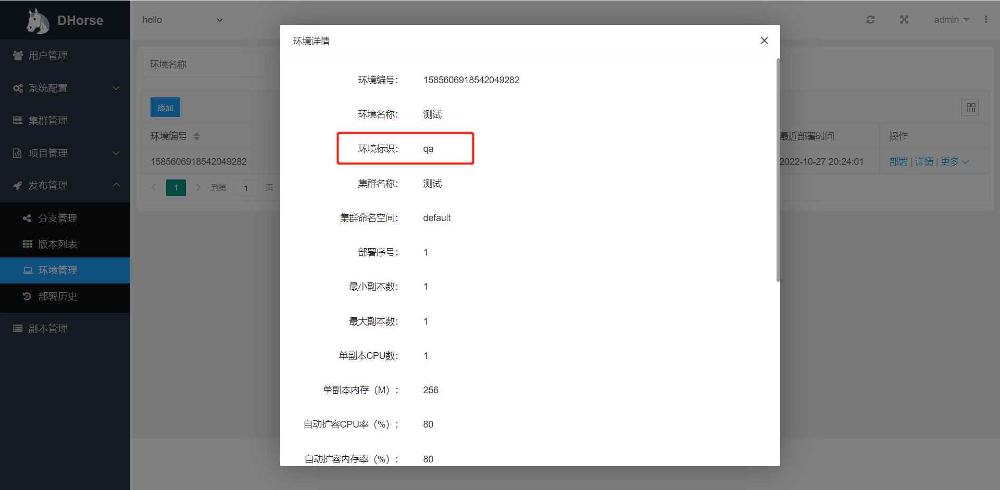

### 环境标识

[DHorse](https://github.com/512team/dhorse)的每个环境都有一个环境标识，如图1所示：

图1

在部署应用后，DHorse会为每个应用集成该标识的值，应用可以在代码里直接使用该值，下面分别介绍。

### Springboot应用

该标识的值可以用于读取多环境的配置信息，如Apollo、Nacos等。

可以通过如下代码获取该标识的值：

```java
@Value("${env}")
private String env;
```

或者，在properties文件中使用该标识的值：

```properties
env=${env}
```

### Nodejs应用

可以通过process.env.NODE_ENV变量来获取环境的值，如：

```javascript
if (process.env.NODE_ENV === 'development') {
	// ...
}
if (process.env.NODE_ENV === 'production') {
	// ...
}
```