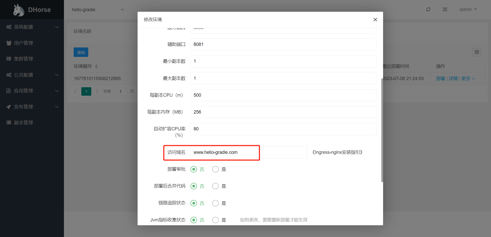

目前，DHorse([https://gitee.com/i512team/dhorse](https://gitee.com/i512team/dhorse))只支持Ingress-nginx的Ingress实现，下面介绍Ingress-nginx的安装过程。

#### 下载安装文件

首先，需要匹配Ingress-nginx版本和kubernetes版本。
在[https://github.com/kubernetes/ingress-nginx](https://github.com/kubernetes/ingress-nginx)可以找到，如下图所示：


笔者用的k8s版本是v1.21.2，需要安装Ingress-nginx的v1.3.1版本，下载如下文件：

```shell
wget https://raw.githubusercontent.com/kubernetes/ingress-nginx/controller-v1.3.1/deploy/static/provider/cloud/deploy.yaml
```

#### 替换镜像地址

查看该文件用到了哪些镜像：

```shell
[root@centos05 deployment]# cat deploy.yaml | grep image
        image: registry.k8s.io/ingress-nginx/controller:v1.3.1@sha256:54f7fe2c6c5a9db9a0ebf1131797109bb7a4d91f56b9b362bde2abd237dd1974
        imagePullPolicy: IfNotPresent
        image: registry.k8s.io/ingress-nginx/kube-webhook-certgen:v1.3.0@sha256:549e71a6ca248c5abd51cdb73dbc3083df62cf92ed5e6147c780e30f7e007a47
        imagePullPolicy: IfNotPresent
        image: registry.k8s.io/ingress-nginx/kube-webhook-certgen:v1.3.0@sha256:549e71a6ca248c5abd51cdb73dbc3083df62cf92ed5e6147c780e30f7e007a47
        imagePullPolicy: IfNotPresent
```

可以看出，所用到的镜像不在docker hub中，在registry.k8s.io中，由于国内的网络问题，拉取不到该仓库的镜像。
幸好[https://dockerproxy.com/docs](https://dockerproxy.com/docs)提供了镜像代理，按照文档的说明，我们需要把registry.k8s.io地址改为k8s.dockerproxy.com即可，替换以后的内容为：

```
registry.k8s.io/ingress-nginx/controller:v1.3.1@sha256:54f7fe2c6c5a9db9a0ebf1131797109bb7a4d91f56b9b362bde2abd237dd1974 ->
k8s.dockerproxy.com/ingress-nginx/controller:v1.3.1@sha256:54f7fe2c6c5a9db9a0ebf1131797109bb7a4d91f56b9b362bde2abd237dd1974
```

```
registry.k8s.io/ingress-nginx/kube-webhook-certgen:v1.3.0@sha256:549e71a6ca248c5abd51cdb73dbc3083df62cf92ed5e6147c780e30f7e007a47 ->
k8s.dockerproxy.com/ingress-nginx/kube-webhook-certgen:v1.3.0@sha256:549e71a6ca248c5abd51cdb73dbc3083df62cf92ed5e6147c780e30f7e007a47
```

#### 安装

保存以后，部署ingress-nginx:

```shell
[root@centos05 deployment]# kubectl apply -f deploy.yaml 
namespace/ingress-nginx created
serviceaccount/ingress-nginx created
serviceaccount/ingress-nginx-admission created
role.rbac.authorization.k8s.io/ingress-nginx created
role.rbac.authorization.k8s.io/ingress-nginx-admission created
clusterrole.rbac.authorization.k8s.io/ingress-nginx created
clusterrole.rbac.authorization.k8s.io/ingress-nginx-admission created
rolebinding.rbac.authorization.k8s.io/ingress-nginx created
rolebinding.rbac.authorization.k8s.io/ingress-nginx-admission created
clusterrolebinding.rbac.authorization.k8s.io/ingress-nginx created
clusterrolebinding.rbac.authorization.k8s.io/ingress-nginx-admission created
configmap/ingress-nginx-controller created
service/ingress-nginx-controller created
service/ingress-nginx-controller-admission created
deployment.apps/ingress-nginx-controller created
job.batch/ingress-nginx-admission-create created
job.batch/ingress-nginx-admission-patch created
ingressclass.networking.k8s.io/nginx created
validatingwebhookconfiguration.admissionregistration.k8s.io/ingress-nginx-admission created
```

查看结果：

```shell
[root@centos05 deployment]# kubectl get pods -n ingress-nginx -o wide
NAME                                        READY   STATUS      RESTARTS   AGE   IP           NODE       NOMINATED NODE   READINESS GATES
ingress-nginx-admission-create-fq2kq        0/1     Completed   0          11s   10.32.1.89   centos06   <none>           <none>
ingress-nginx-admission-patch-fkphb         0/1     Completed   1          11s   10.32.1.90   centos06   <none>           <none>
ingress-nginx-controller-5c79d9494c-rh5rn   0/1     Running     0          11s   10.32.1.91   centos06   <none>           <none>
```

访问ingress-nginx-controller的ip，如下：

```shell
[root@centos05 deployment]# curl http://10.32.1.91
<html>
<head><title>404 Not Found</title></head>
<body>
<center><h1>404 Not Found</h1></center>
<hr><center>nginx</center>
</body>
</html>
```

#### 验证Ingress

假如，我们有一个名为hello-gradle的应用，并且有一个/hello的服务接口，并且绑定了名为www.hello-gradle.com的域名，如下图所示：



部署完该应用以后，在集群的任意节点配置host如下：

```shell
[root@centos06 deployment]# vim /etc/hosts
10.244.0.13 www.hello-gradle.com
```

然后通过域名访问/hello服务，如下：

```shell
[root@centos05 deployment]# curl http://www.hello-gradle.com/hello
Hello!
```