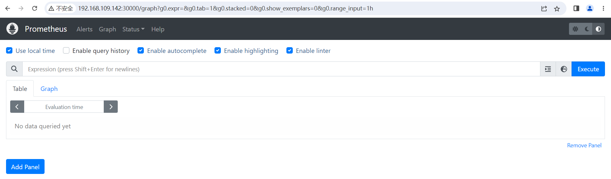
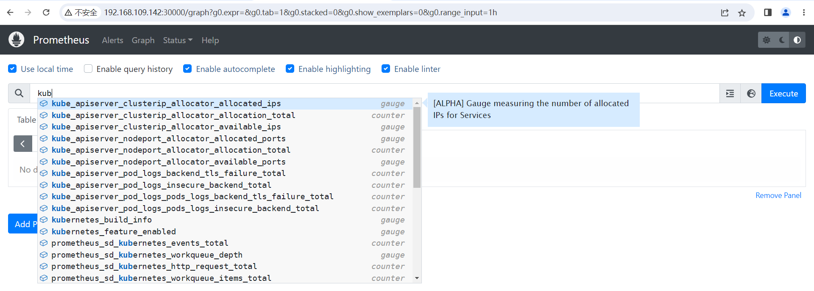
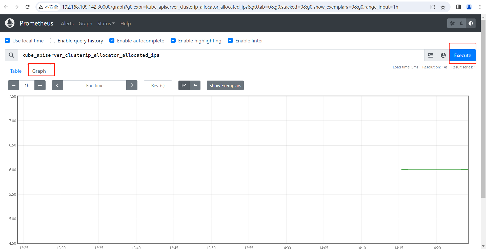

##### 安装

在目标集群上，执行如下命令：

```shell
kubectl apply -f https://gitee.com/i512team/dhorse/raw/main/conf/kubernetes-prometheus.yml
```

##### 使用

1.在浏览器访问地址：http://master_ip:30000，如下图所示：



2.查看k8s自带的指标数据，如下图所示：



3.点击“Execute”按钮，并切换到“Graph”选项卡，可以看到指标的统计信息，如下图所示：

