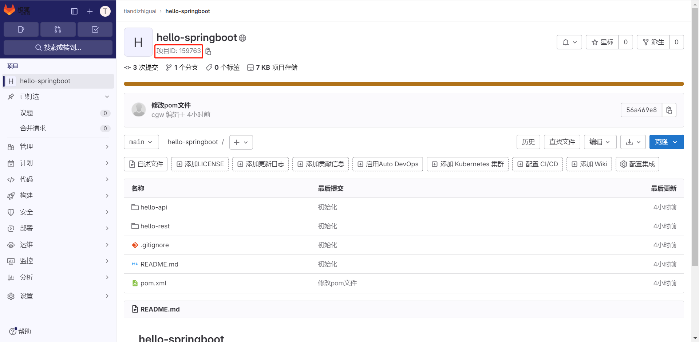

在介绍DHorse的操作之前，我们先来看一下发布一个系统的流程是什么样的。

# 发布系统的流程

我们以一个Springboot系统为例，来说明一下发布流程。
1.首先从代码仓库下载代码，比如Gitlab；
2.接着是进行打包，比如使用[Maven](https://blog.csdn.net/huashetianzu/article/details/127481538)；
3.如果要使用k8s作为编排，还需要把步骤2产生的包制作成镜像，比如使用[Docker](https://blog.csdn.net/huashetianzu/article/details/127376460)；
4.上传步骤3的镜像到远程仓库，比如Harhor；
5.最后，下载镜像并编写Deployment文件部署到云集群，比如k8s；
从以上步骤可以看出，发布需要的工具和环境至少包括：代码仓库（Gitlab）、打包环境（Maven）、镜像制作（Docker）、镜像仓库（Harbor）、云集群（k8s）等；
在DHorse系统里，有些环境是对于用户来说是无需感知，因为已经做了集成，如：打包和镜像制作，可以参考文章：《[DHorse系列文章之镜像制作](https://blog.csdn.net/huashetianzu/article/details/127376460)》和《[DHorse系列文章之maven打包](https://blog.csdn.net/huashetianzu/article/details/127481538)》。其他的则需要配置，下面就一一介绍。

# DHorse操作说明

## 代码仓库配置

如图1所示：

图1

## 镜像仓库配置

如图2所示：

图2

## Maven配置

如图3所示：

图3
在这里，可以指定打包时的Java版本信息，如果不指定，则默认使用DHorse系统所在的环境。

## 集群配置

进入“集群管理”菜单，可以进行添加集群操作，假如已经部署好k8s集群，则可以添加到DHorse，如图4所示：

图4
我们可以通过如下方式生成k8s的认证令牌：

```shell
kubectl create serviceaccount "k8sadmin-dhorse" -n kube-system
kubectl create clusterrolebinding "k8sadmin-dhorse" --clusterrole=cluster-admin --serviceaccount=kube-system:k8sadmin-dhorse
secret=$(kubectl get -n kube-system serviceaccounts "k8sadmin-dhorse" -o jsonpath='{.secrets[0].name}')
kubectl get -n kube-system secrets $secret -o jsonpath='{.data.token}' | base64 -d
```

也可以开启日志收集功能，但是首先需要在Dhorse的安装目录下修改conf/filebeat-k8s.yml文件，进行filebeat的配置。
在“集群管理”菜单下，同时也提供了对命名空间管理的功能，如图5所示：

图5
可以创建和删除命名空间。
完成以上配置以后，接下来我们就可以创建应用、创建版本、创建环境，然后进行发布了。

## 创建应用

在“应用管理”菜单下，可以添加应用操作，这里以添加一个Springboot应用为例进行说明，如图6、图8所示：

图6

其中，代码仓库地址是对应代码仓库定义的项目路径或项目编号，比如GitLab的项目编号如图7所示：

图7


图8

添加应用完成以后，就可以在“发布管理”菜单下看到分支信息，如图9所示：

图9

可以看出，在分支列表里可以分别对每个分支进行“构建版本”操作，我们以master分支构建为例，如图10所示：

图10

然后进入“版本列表”菜单，可以看到产生了一条版本记录，同时也可以查看该版本的构建日志，如图11所示：

图11

接下来，我们就可以创建一个环境，然后使用刚才构建的版本发布该环境。

## 发布应用

进入“环境管理”菜单，然后进行添加环境操作，如图12所示：

图12

保存之后，“环境管理”列表里会出现一条环境记录，如果13所示：

图13

接着，我们可以在“操作”列点击“部署”按钮，如图14所示：

图14

选择刚才的版本，并点击“确认部署”。然后，进入到“部署历史”菜单下，可以看到产生了一条部署记录，同样可以查看该记录的日志，如图15所示：

图15

等待部署完成以后，进入“副本管理”菜单，可以看到副本（Pod）的相关信息，如果16所示：

图16

至此，一个完整的发布流程完成了。那么该如何访问hello应用的服务呢？

## 访问服务

### 集群内访问
假如hello应用里有一个/hello的api。
1. 访问单个副本的服务
通过“副本IP:端口”进行访问，该方式在副本或Node节点都可以访问通，如图16所示的IP，访问示例：http://10.32.1.153:8080/hello
2. 通过负载均衡
DHorse在部署应用以后，会默认为应用启动一个ClusterIP的service服务，可以通过“应用名称.命名空间:服务端口”来访问服务，该访问只能在副本里进行，示例如：http://hello.default:8080/hello
集群内服务之间的调用，推荐该方式。

### 集群外访问
两种方式：
1. 通过创建NodePort或LoadBalancer，目前DHorse不支持，如果需要可以手动在集群内创建；
2. 打通集群内外的网络，该方式需要运维的支持，如：通过静态路由转发等。集群内外网络互通以后，在集群外部就可以直接访问副本的IP了。
