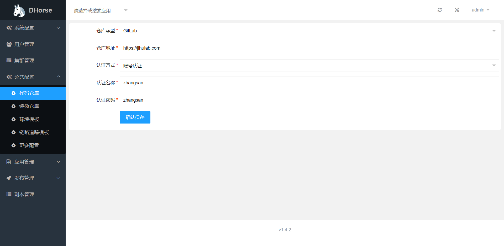
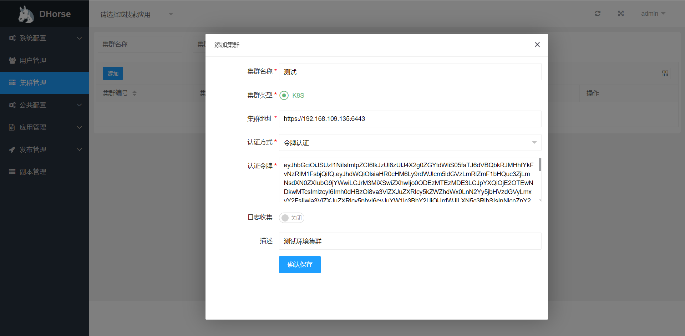
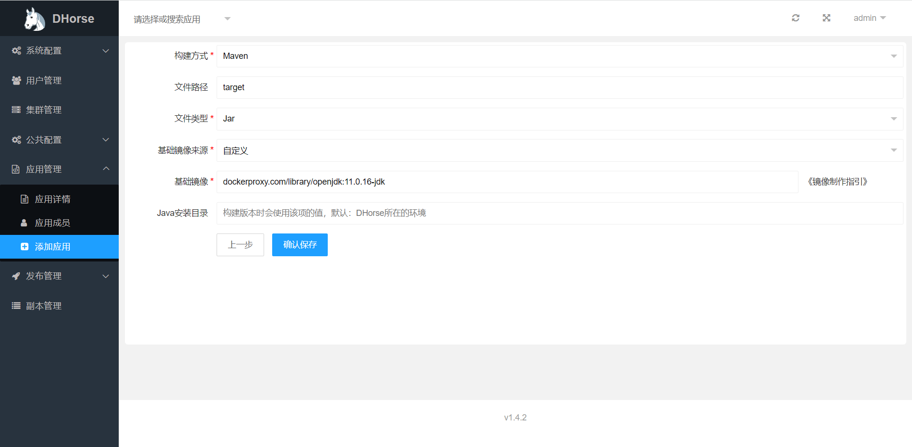
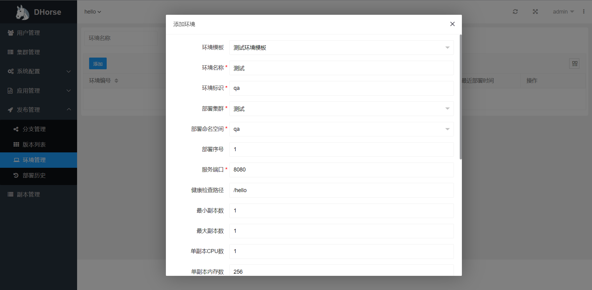

# 前言

在介绍[DHorse](https://github.com/tiandizhiguai/dhorse)的操作之前，先来介绍一下使用k8s发布应用的步骤，以一个Springboot应用为例进行说明。

1.首先从代码仓库下载代码，比如GitLab；  
2.接着是进行打包，比如使用Maven；  
3.如果要使用k8s作为编排，还需要把步骤2产生的包制作成镜像，比如使用Docker；
4.上传步骤3的镜像到远程仓库，比如Harhor；  
5.最后，下载镜像并编写Deployment文件部署到云集群，比如k8s；  
从以上步骤可以看出，发布需要的工具和环境至少包括：代码仓库（GitLab）、打包环境（Maven）、镜像制作（Docker）、镜像仓库（Harbor）、云集群（k8s）等；  
在DHorse系统里，有些环境是对于用户来说是无需感知，因为已经做了集成，如：打包和镜像制作，可以参考文章：《[DHorse镜像制作原理](https://github.com/tiandizhiguai/dhorse-doc/blob/main/guide/%E9%95%9C%E5%83%8F%E5%88%B6%E4%BD%9C.md)》和《[DHorse的打包原理](https://github.com/tiandizhiguai/dhorse-doc/blob/main/guide/maven%E6%89%93%E5%8C%85.md)》。其他的则需要配置，下面就一一介绍。

# DHorse操作说明

## 代码仓库配置

如图1所示：

图1

## 镜像仓库配置

如图2所示：

图2

## Maven配置

如图3所示：

图3

在这里，可以指定打包时的Java版本信息，如果不指定，则默认使用DHorse系统所在的环境。

## 集群配置

进入“集群管理”菜单，可以进行添加集群操作，假如已经部署好k8s集群，则可以添加到DHorse，如图4所示：

图4

可以通过如下方式生成k8s的认证令牌：

1. 小于1.24版本

```shell
kubectl create serviceaccount dhorse-admin -n kube-system
kubectl create clusterrolebinding dhorse-admin --clusterrole=cluster-admin --serviceaccount=kube-system:dhorse-admin
secret=$(kubectl get -n kube-system serviceaccounts dhorse-admin -o jsonpath='{.secrets[0].name}')
kubectl get -n kube-system secrets $secret -o jsonpath='{.data.token}' | base64 -d
```

2. 大于等于1.24版本

```shell
kubectl create serviceaccount dhorse-admin -n kube-system
kubectl create clusterrolebinding dhorse-cluster-admin --clusterrole=cluster-admin --serviceaccount=kube-system:dhorse-admin
kubectl create token dhorse-admin -n kube-system
```
也可以开启日志收集功能，但是首先需要在Dhorse的安装目录下修改conf/filebeat-k8s.yml文件，进行filebeat的配置，可以参考[这里](https://github.com/tiandizhiguai/dhorse-doc/blob/main/guide/%E6%97%A5%E5%BF%97%E6%94%B6%E9%9B%86.md)。

在“集群管理”菜单下，同时也提供了对命名空间管理的功能，如图5所示：

图5

在这里可以创建和删除命名空间。

完成以上配置以后，接下来就可以创建应用、创建版本、创建环境，然后进行发布了。

## 创建应用

在“应用管理”菜单下，可以添加应用操作，这里以添加一个Springboot应用为例进行说明，如图6、图8所示：

图6

其中，代码仓库地址是对应代码仓库定义的项目路径或项目编号，比如GitLab的项目编号如图7所示：

图7


图8

添加应用完成以后，就可以在“发布管理”菜单下看到分支信息，如图9所示：

图9

可以看出，在分支列表里可以分别对每个分支进行“构建版本”操作，以master分支构建为例，如图10所示：

图10

然后进入“版本列表”菜单，可以看到产生了一条版本记录，状态是构建中，同时也可以查看该版本的构建日志，如图11所示：

图11

特别注意，第一次构建版本时由于Maven需要下载依赖的包，速度会比较慢，需要耐心等待。接下来，就可以创建一个环境，然后使用刚才构建的版本发布该环境。

## 发布应用

进入“环境管理”菜单，然后进行添加环境操作，如图12所示：

图12
其中，“环境模板”选项的值可以在“系统配置-环境模板”菜单下进行配置。

保存之后，“环境管理”列表里会出现一条环境记录，如果13所示：

图13

接着，可以在“操作”列点击“部署”按钮，如图14所示：

图14

选择刚才的版本，并点击“确认部署”。然后，进入到“部署历史”菜单下，可以看到产生了一条部署记录，同样可以查看该记录的日志，如图15所示：

图15

等待部署完成以后，进入“副本管理”菜单，可以看到副本（Pod）的相关信息，如果16所示：

图16

至此，一个完整的发布流程完成了。最后，再来看看如何访问hello应用的服务。

## 访问服务

### 集群内访问

假如hello应用里有一个/hello的api。

1. 访问单个副本的服务

可以通过“副本IP:端口”进行访问，该方式在副本或Node节点都可以访问通，如图16所示的IP，访问示例：http://10.32.1.153:8080/hello

2. 通过负载均衡

DHorse在部署应用以后，会为每个应用启动一个ClusterIP的service服务，那么就可以在副本里通过“应用名称-环境标识.命名空间:服务端口”的形式来访问其他应用的服务，访问示例如：http://hello-qa.default:8080/hello ，集群内服务之间的调用，推荐该方式。

### 集群外访问

两种方式：

1. 通过创建NodePort或LoadBalancer，目前DHorse不支持，如果需要可以手动在集群内创建；

2. 打通集群内外的网络，该方式需要运维的支持，如：通过静态路由转发等。集群内外网络互通以后，在集群外部就可以直接访问副本的IP了。
