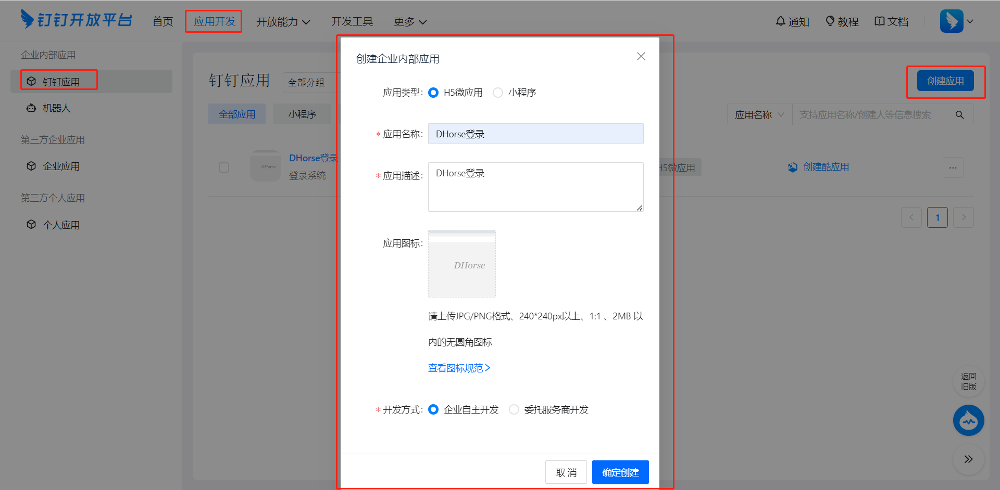
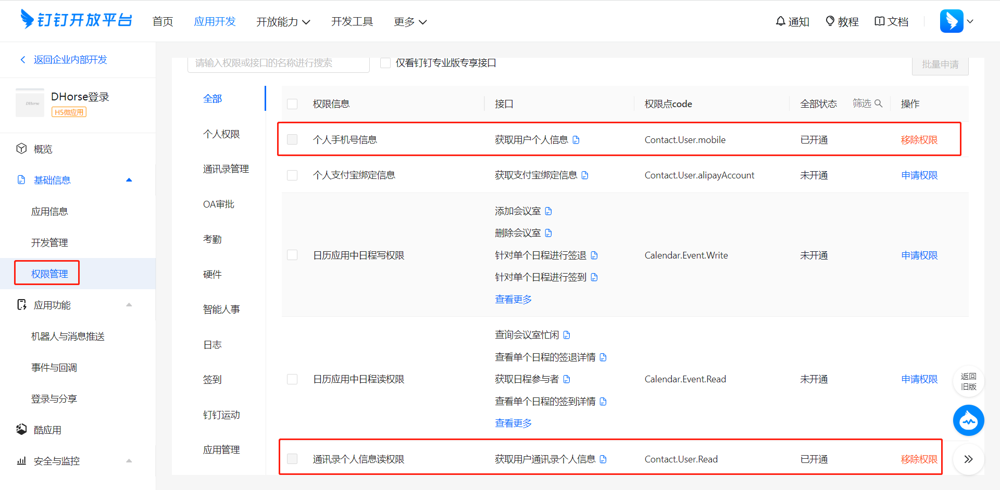
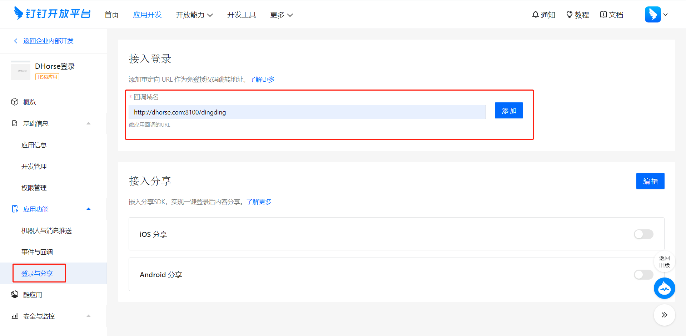
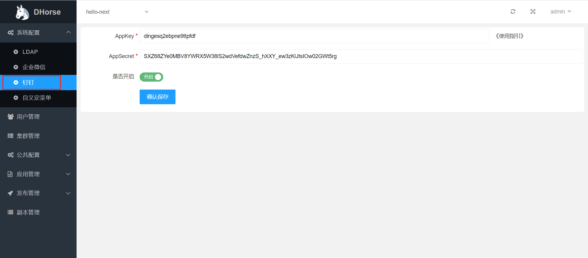
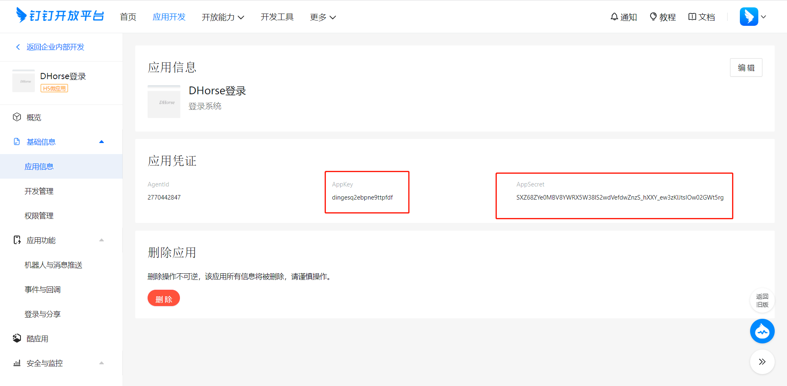

开启钉钉登录，需要具备以下几个条件：
* 需要拥有钉钉后台的管理权限；
* 需要创建钉钉应用；
* 需要进行DHorse的钉钉配置；

### 创建应用

进入钉钉管理后台，创建应用，如图1所示：

图1

### 配置应用

#### 配置接口权限

进入应用管理页面，需要开通接口权限，如图2所示：

图2

#### 配置回调接口

如图3所示：

图3

其中，dhorse.com:8100是你部署dhorse的域名和端口。

### 配置DHorse

如图4所示：

图4

其中，AppKey和AppSecret的值如图5所示：

图5
