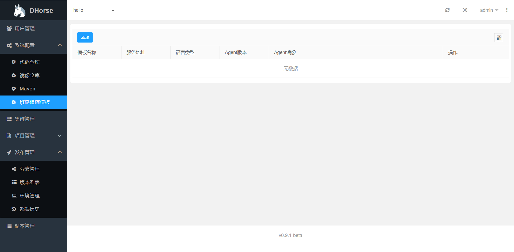
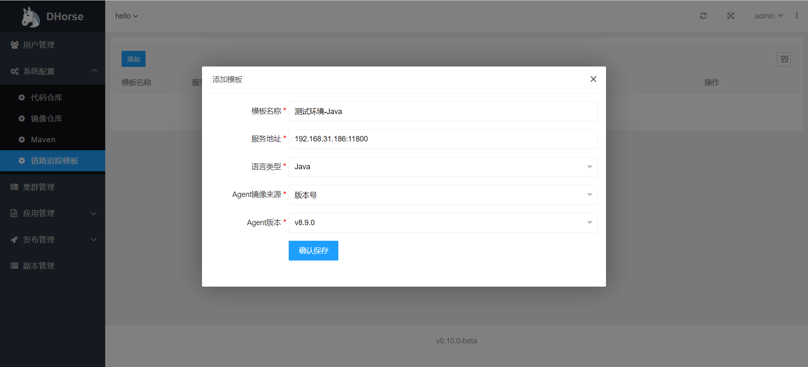
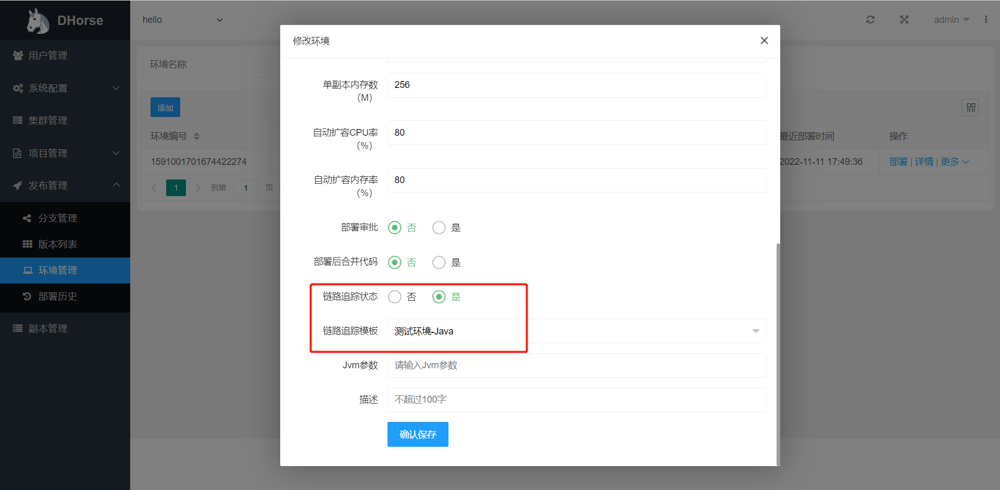
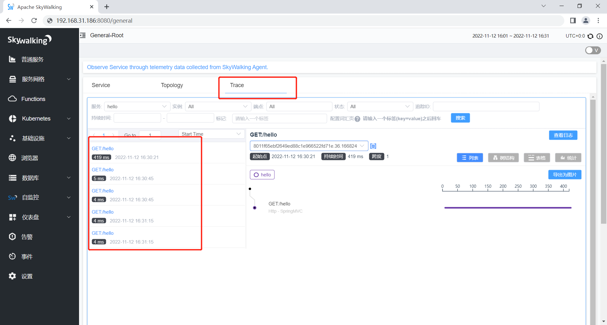

目前，DHorse的链路追踪功能是通过SkyWalking来实现。大致的实现原理是DHorse在部署应用时，通过指定SkyWalking的agent来收集服务之间的调用链路信息。那么DHorse是如何使用SkyWalking的agent呢？我们就先来看一下DHorse的操作。

## 链路追踪配置

在“系统配置”菜单，打开“链路追踪模板”菜单如图1所示：

图1

我们添加一个模板，如图2所示：

图2

其中，服务地址是SkyWalking服务器的地址，Agent版本和Agent镜像其中一项有值即可。如图2中所示，如果两项都有值，则优先使用Agent镜像的值，如果选择了Agent版本，最好和SkyWalking服务器的版本保持一致。讲到这里，大家可能有些疑问，Agent版本和Agent镜像是两个风马牛不相及的东西，为什么可以归为到一类。答案是这样，如果选择了Agent版本，在保存之后，DHorse会在后台默认生成一个Agent镜像并上传到镜像仓库。看到没有，其实最终用的都是Agent镜像。那么又有一个疑问，该如何自定义一个Agent镜像呢？DHorse是不是对规则有一定的要求呢？答案是有要求，下面就来详细看一下制作过程。

## 制作Agent镜像

用Dockerfile来制作，具体步骤如下：
1. [下载Agent](https://skywalking.apache.org/downloads/)，并复制文件到/op/agent目录，后续操作都在该目录下进行
2. 解压tgz包

```shell
tar -zxvf apache-skywalking-java-agent-*.tgz
```

3. 制作Dockerfile文件，内容如下：

```Dockerfile
FROM busybox:latest
COPY skywalking-agent/ /skywalking-agent
```

4. 当前目录内容如下：

```shell
-rw-r--r--  1 root  root 30119842 Apr 11  2022 apache-skywalking-java-agent-8.9.0.tgz
-rw-r--r--  1 root  root       61 Nov 11 17:47 Dockerfile
drwxrwxr-x 10 admin 1002      221 Jan 28  2022 skywalking-agent
```

5. 制作镜像：

```shell
docker build -t 192.168.109.131:20080/dhorse/skywalking-agent:v8.9.0 .
```

6. 登录Harbor仓库：

```shell
docker login -u admin -p admin 192.168.109.131:20080
```

7. 上传镜像：
```shell
docker push 192.168.109.131:20080/dhorse/skywalking-agent:v8.9.0
```

配置好链路追踪的模板以后，我们再来看看如何使用。

## 链路追踪使用

在“环境管理”菜单下，进行修改操作，开启链路追踪状态和选择链路追踪模板，如图3所示：

图3

保存修改之后，重新发布该环境的项目。然后请求该环境的服务，打开SkyWalking Web，在Trace的菜单下可以看到上报的链路信息，如图4所示：

图4