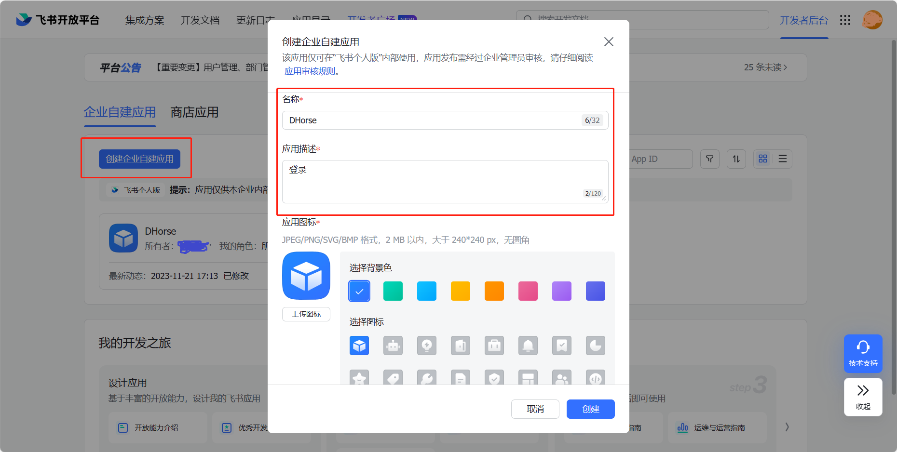
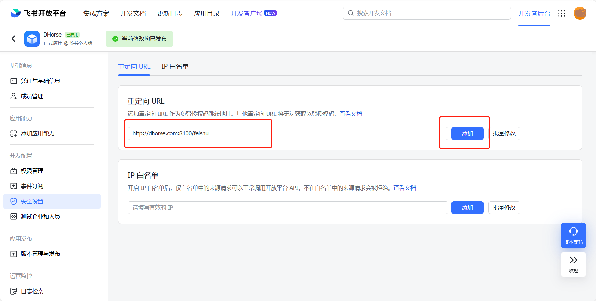
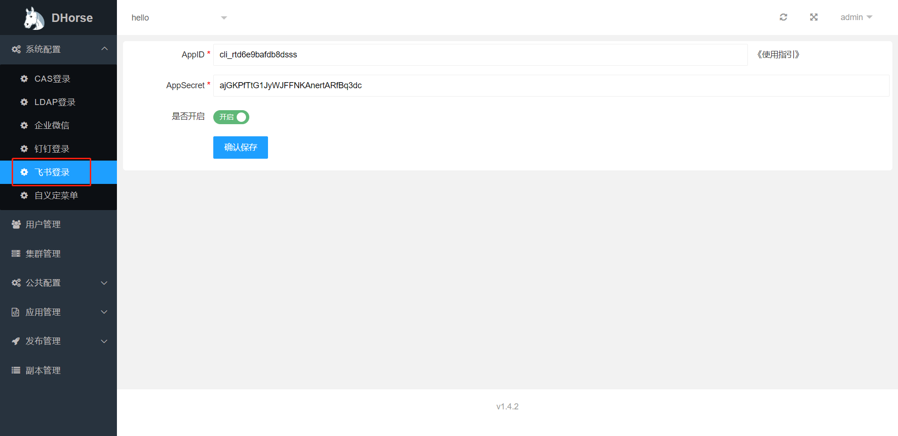
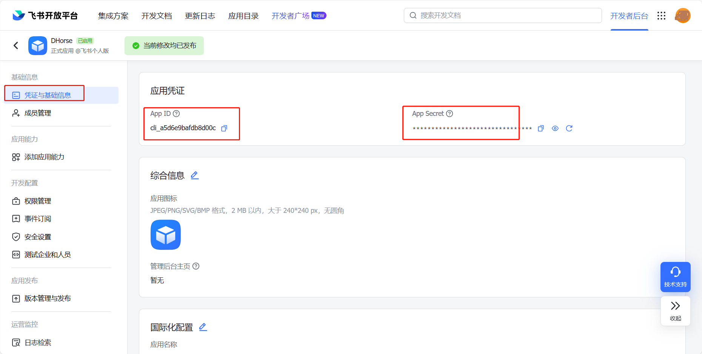

开启飞书登录，需要具备以下几个条件：
* 需要拥有飞书后台的管理权限；
* 需要创建飞书应用；
* 需要进行DHorse的飞书配置；

### 创建应用

进入飞书管理后台，创建应用，如图1所示：

图1

### 配置应用

#### 配置回调接口

如图2所示：

图2

其中，dhorse.com:8100是你部署dhorse的域名和端口，/feishu是固定值。

#### 发布应用版本

如图3所示：

图3

### 配置DHorse

如图4所示：

图4

其中，AppID和AppSecret的值如图5所示：

图5
