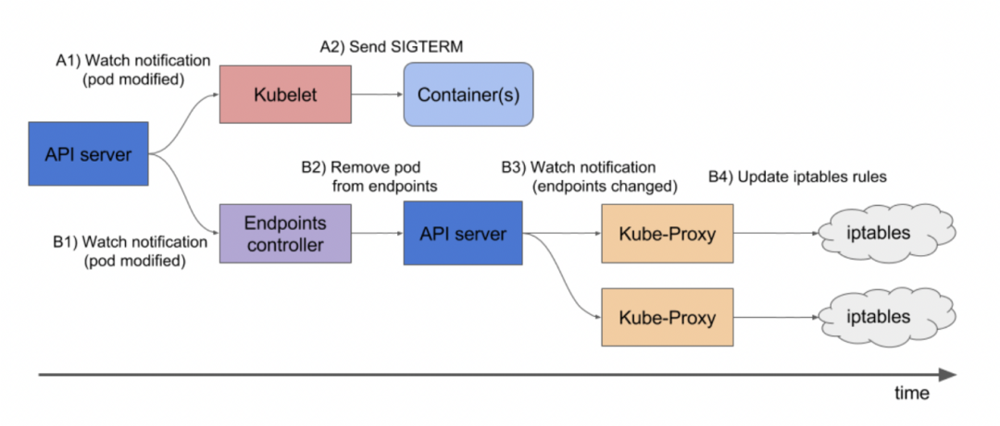
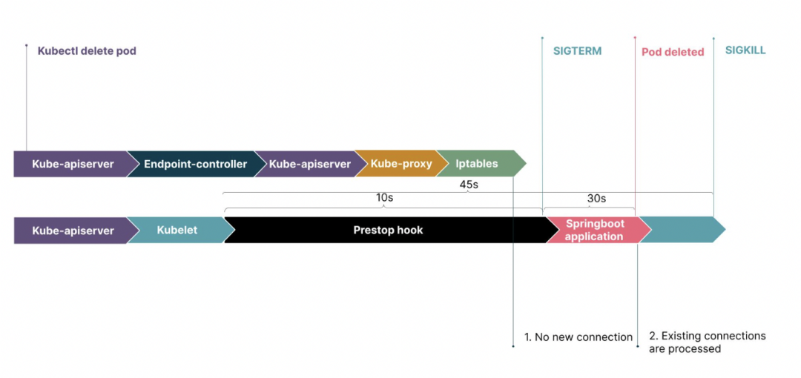

在应用程序的整个生命周期中，正在运行的 pod 会由于多种原因而终止。在某些情况下，Kubernetes 会因用户输入（例如更新或删除 Deployment 时）而终止 pod。在其他情况下，Kubernetes 需要释放给定节点上的资源时会终止 pod。无论哪种情况，Kubernetes 都允许在 pod 中运行的容器在可配置的时间内正常关闭。

请查看下面的图表，以便更好地了解删除 pod 时发生的情况。



以下是 Pod 关闭的 2 个场景。

##### 优雅关机

在这种情况下，pod 中的容器会在宽限期内正常关闭。容器的“正常关闭”状态表示执行可选的 pre-stop hook 和 Pod 响应 SIGTERM 信号。一旦容器成功退出，Kubelet 就会从 API Server 中删除 pod。

##### 强制关机

在这种情况下，容器无法在宽限期内关闭。关闭失败可能是由于多种原因，包括

* 应用程序忽略 SIGTERM 信号，
* pre-stop hook 花费的时间超过宽限期，
* 应用程序清理资源花费的时间超过宽限期
* 以上的组合

当应用程序在宽限期内无法关闭时，Kubelet 会发送一个 SIGKILL 信号来强制关闭 pod 中运行的进程。根据应用程序，这可能会导致数据丢失和面向用户的错误。

在本文中，我们将重点分析优雅关闭部分。

##### 识别问题

在 Kubernetes 中，每次部署都意味着在删除旧 pod 的同时创建新版本的 pod。
如果在此过程中没有正常关闭，可能会出现两个问题：
1.当前正在处理请求的 pod 被移除，如果请求不是幂等的，则会导致状态不一致。
2.Kubernetes 将流量路由到已经被删除的 Pod，导致处理请求失败，用户体验差。

##### 分析问题

在删除 Kubernetes pod 的过程中，有两条平行的时间线，如下图所示。一是改变网络规则的时间线。另一个是 pod 的删除。


当运维人员或部署管道执行kubectl delete pod 命令时，两个过程开始。

##### 网络规则生效

1.kube-apiserver 接收到 pod 删除请求，将 pod 在 Etcd 中的状态更新为 Terminating；
2.Endpoint Controller 从 Endpoint 对象中删除 pod 的 IP；
3.kuber-proxy 根据 Endpoint 对象的变化更新 iptables 的规则，不再将流量路由到被删除的 Pod。

##### 删除 pod

1.kube-apiserver 接收到 Pod 删除请求，将 Pod 的再 Etcd 中的状态更新为 Terminating
2.Kubelet 在节点清理容器相关资源，如存储、网络
3.Kubelet 向容器发送 SIGTERM；如果容器内的进程没有配置，容器将立即退出。
4.如果容器在默认的 30 秒内没有退出，Kubelet 将发送 SIGKILL 并强制它退出。

通过删除 pod 的过程，我们可以看到如果容器内的进程没有配置，容器会立即退出，导致问题 1。
由于更新网络规则和删除 Pod 是同时进行的，因此不能保证在删除 Pod 之前更新网络规则。这就是可能导致问题 2 的原因。

##### 解决方案

以下配置可以解决这些问题：

1.为容器内的进程设置正常关闭。
2.添加 preStopHook。
3.修改终止 GracePeriodSeconds。

下图显示了设置后的时间线



##### 对于问题 1：为容器内的进程设置正常关闭

以 SpringBoot 为例，启用优雅关闭可以 Spring Boot 配置文件中添加下面设置：

```yaml
server:
    shutdown: graceful

spring:
    lifecycle:
         timeout-per-shutdown-phase: 30s
```

通过使用上述配置，Spring Boot 保证在收到 SIGTERM 后不再接受新请求，并在超时内完成所有正在进行的请求的处理。即使无法及时完成，也会记录相关信息，然后强制退出。

对于 timeout 的值，应参考处理请求的最大允许持续时间。根据我们的经验，除特殊情况外，所有请求通常在 30 秒内完成处理。对于未在定义的超时时间内完成的，我们将在日志监控中捕获超时并发送警报，然后解决超时的根本原因并采取相应的措施。

这就是可以解决问题 1 的方法。其他语言和框架应该有类似的配置。

##### 对于问题 2：添加 preStopHook

要处理问题 2，我们必须在不再将新流量路由到该 pod 后开始删除该 pod。因此，应该将 preStopHook 添加到 Kubernetes yaml 文件中，让 Kubelet 在收到删除 pod 事件时“sleep 一下”，并在开始删除 pod 之前留出足够的时间来更新网络规则。

```yaml
lifecycle:
  preStop:
     exec:
        command: ["sh", "-c", "sleep 10"]  # set prestop hook
```

上述配置将导致 Kubelet 等待设定的时间。

##### 修改终止 GracePeriodSeconds

参考之前删除 Pod 的分析，Kubernetes 为容器删除留下了 30 秒的最大时间尺度。如果 Spring 的优雅关闭超时时间和 Kubernetes 的 preStopHooks 之和超过 30 秒，可能会导致 Kubernetes 在 Spring Boot 处理完请求之前强行删除容器。因此，如果过程超过 30 秒，则应将 timerminationGracePeriodSeconds 调整为超出 Spring 加 preStopHook 的优雅关闭超时。

```yaml
terminationGracePeriodSeconds: 45
```

最后，完整的 Kubernetes yaml 文件如下所示：

```yaml
apiVersion: apps/v1
kind: Deployment
metadata:
   name: gracefulshutdown-app
spec:
  replicas: 3
  selector:
     matchLabels:
           app: gracefulshutdown-app
  template:
    metadata:
       labels:
         app: gracefulshutdown-app
    spec:
      containers:
        - name: graceful-shutdown-test
          image: gracefulshutdown-app:latest
          ports:
            - containerPort: 8080
          lifecycle:
            preStop:
              exec:
                command: ["sh", "-c", "sleep 10"]  #set prestop hook
       terminationGracePeriodSeconds: 45 # terminationGracePeriodSeconds
```

1.在Spring Boot中设置正常关闭可确保在容器终止之前完成处理正在进行的请求。
2.设置 preStopHook 确认删除 pod 和更新网络规则之间的顺序关系。3. 最后，为了给进程留出充裕的时间来处理所有请求，设置 terminationGracePeriodSeconds。

通过这三个步骤，我们可以充分解决这两个问题。本文描述了一种解决方案，用于确保假设服务将正确处理零停机部署所需的所有请求。因此，构建此功能将丰富用户体验并减少将缺陷引入服务的影响。

最后，推荐一个部署应用的平台: [https://github.com/512team/dhorse](https://github.com/512team/dhorse)

演示地址：[http://dhorse-demo2.512.team](http://dhorse-demo2.512.team)
